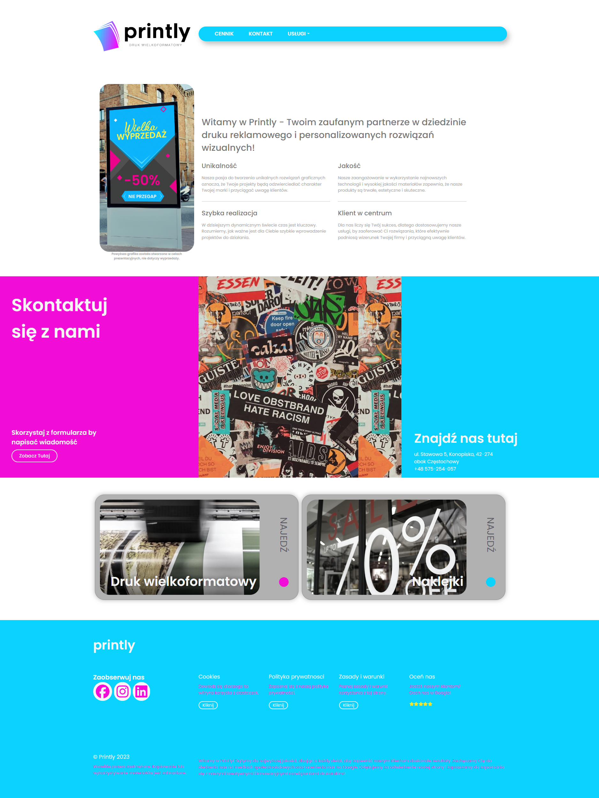
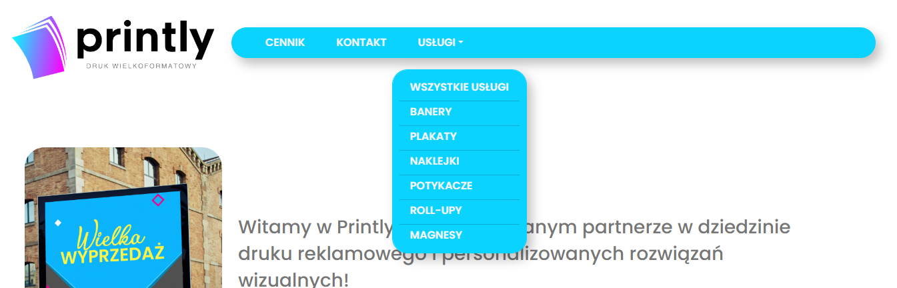
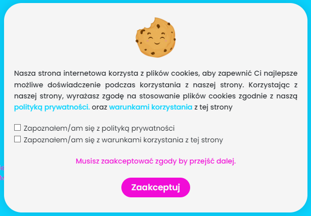
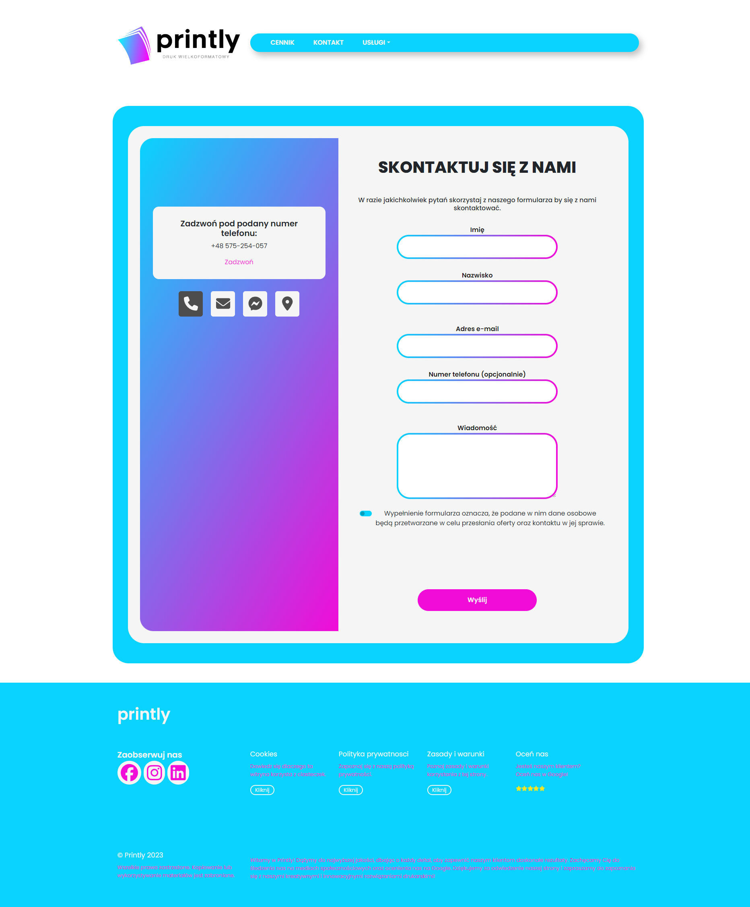
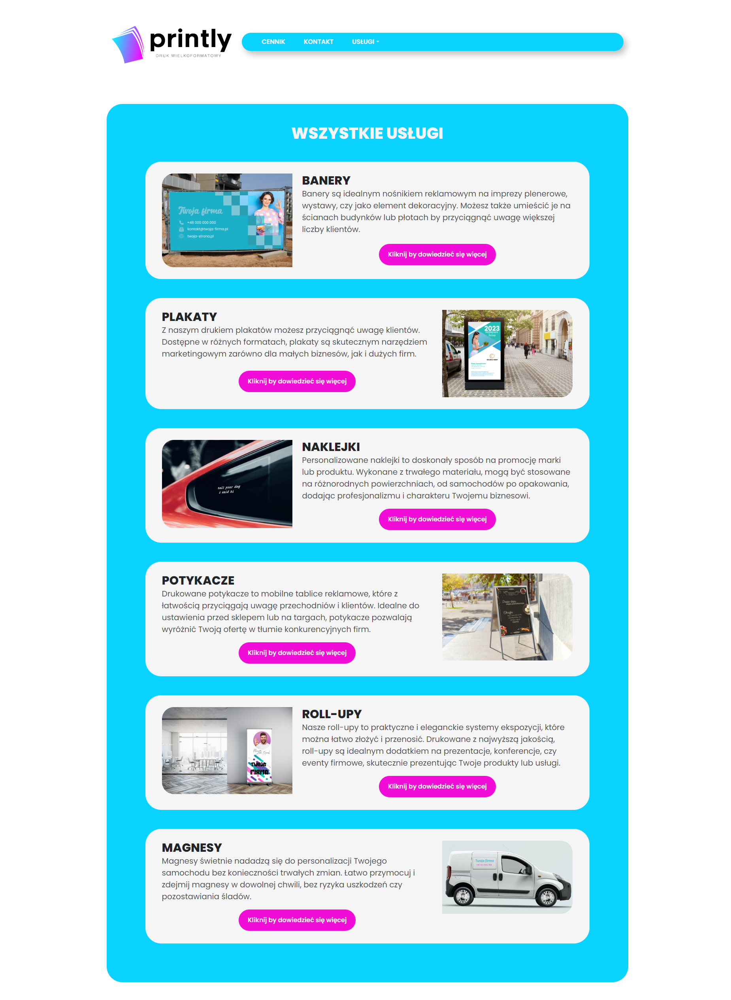
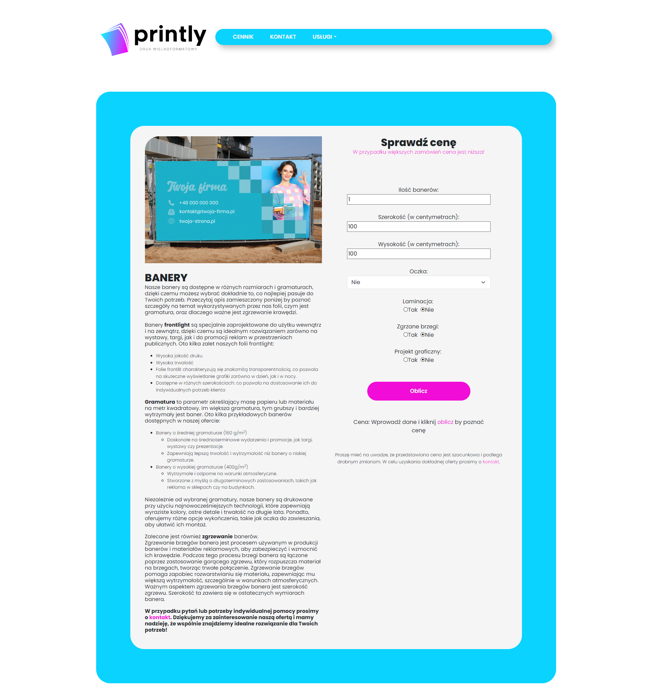

# Printly App

Printly App is a React-based application designed to offer a variety of customizable printing services, including banners, posters, stickers, and more. The app features a modern and responsive design to provide an intuitive user experience and easy navigation, helping users find and customize the products they need quickly.

## Author

- **Name**: Klaudia Jędryszczak
- **Email**: jedryszczakklaudia@gmail.com

#### Link - 'https://printly.net.pl'

## Setup and Configuration

1. Navigate to directory

```bash
cd printly-app
```

2. Install dependencies:

```bash
npm install
```

3. To start the project locally, run:

```bash
npm start
```

After setting up, visit[ localhost:3000]() to access the form

## Components

### App.js

This is the main entry component for the application, setting up routing using React Router and including key elements such as the main navigation, footer, and cookie consent modal. `App.js` defines routes for various pages, including:

- **Home** (Hero): The main landing page that welcomes users.
- **Contact**: A page with a contact form and a Google Maps integration to display the business location.
- **Policy and Terms:** Contains privacy policy and terms of service.
- **Price List:** Displays pricing information for different services.
- **Services:** Provides an overview of all available services.
- Specific service pages like **Banners**, **Posters**, **Stickers**, **Aboards**, **Rollups**, and **Magnets**: Each page is tailored to its respective product category, offering specific customization options and additional information.

### Hero.js

The `Hero` component serves as the main landing section, highlighting Printly's unique value propositions such as high-quality prints, customer-focused service, and quick turnaround times. It’s designed to adapt to different screen sizes for an optimal user experience and includes animations triggered on scroll for added visual appeal.


### Navbar.js

The `Navbar` component defines the navigation structure, offering links to various pages and a dropdown menu for easy access to service categories. Main navigation links include:

- Price List
- Contact
- Services, with subcategories for Banners, Posters, Stickers, and other customizable products.
  

### Footer.js

The `Footer` component includes links to Printly’s social media profiles, additional informational pages, and contact details.

### CookieModal.js

A cookie consent modal that informs users about the app's use of cookies, ensuring compliance with privacy regulations.


### Contact.js

This project includes a responsive contact form with email functionality and a ReCAPTCHA verification. The form is implemented using `React`, `React-Bootstrap`, `emailjs`, and `react-google-recaptcha`. It provides multiple contact options and adapts to both desktop and mobile views.

Features

- **Email Sending:** Sends emails using EmailJS. The email template ID, service ID, and public key must be configured.
- **ReCAPTCHA Verification:** Uses Google reCAPTCHA to prevent spam. Ensure you configure your sitekey in the ReCAPTCHA component.
- **Responsive Layout:** The form adapts for both desktop and mobile views, showing different layouts for wider screens vs. mobile.
- **Contact Options:** The form includes options to contact via:
  - Phone
  - Email
  - Facebook Messenger
  - Location
    

### Services

`Services` includes information about all Services and buttons that takes us to seperate page for each service.


### Calculators

Printly App includes several dedicated calculators for specific products:

- Stickers, Rollups, Magnets, Banners, Aboards, etc., each tailored to the unique needs of the respective products, allowing users to customize size, materials, quantity, and other options. Each calculator provides a quick, user-friendly way for customers to estimate prices based on their specific requirements.
  

`Above - example calculator for Banners. Each calculator is different and tailored to specific service needs`

## Technologies Used

- **React**: A JavaScript library for building user interfaces.
- **Redux**: A state management tool for JavaScript applications.
- **React Router**: A library for routing in React applications.
- **Axios**: A promise-based HTTP client for making requests.
- **Material-UI**: A popular React UI framework for designing responsive web applications.
- **Bootstrap:** For responsive layout and styling.

